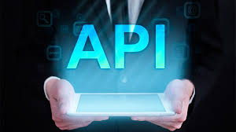

# laAPIbuena

Tras intentar sin éxito realizar el proyecto de creación de API, en este segundo intento voy a seguir los
pasos de creación uno a uno, desde la instalación de Flask hasta el análisis de sentimientos. 
El objetivo no es la propia creación de la API en si misma si no ir siguiendo y apuntando cada uno de los pasos
que se han ido dando en clase desde el jueves. De esta manera espero llegar a comprender mejor el proceso, así como 
dejar anotado en qué lugares me quedo totalmente atascado, para más tarde ser capaz de contruir conocimiento desde 
esos puntos.
El proceso a seguir se irá especificando en el archivo proceso.py que se encuentra en OUTPUT para tal fin.
